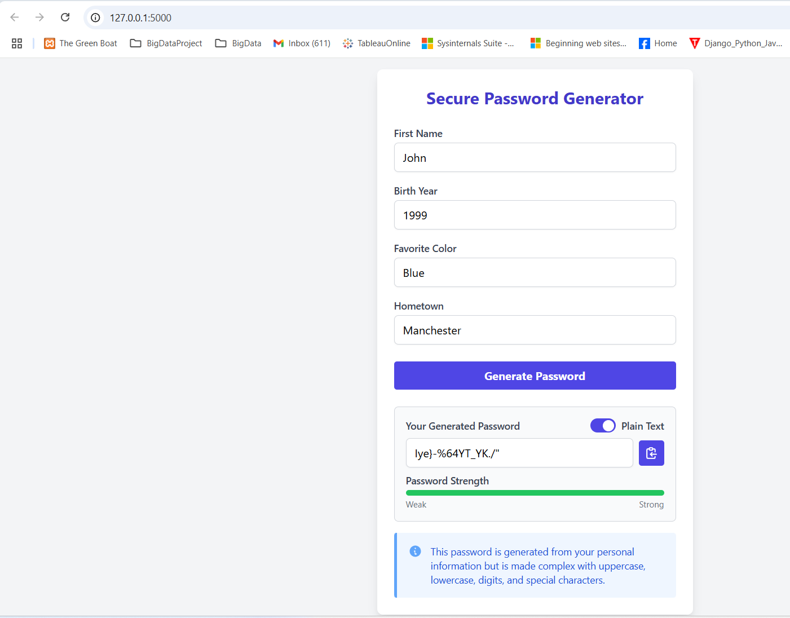
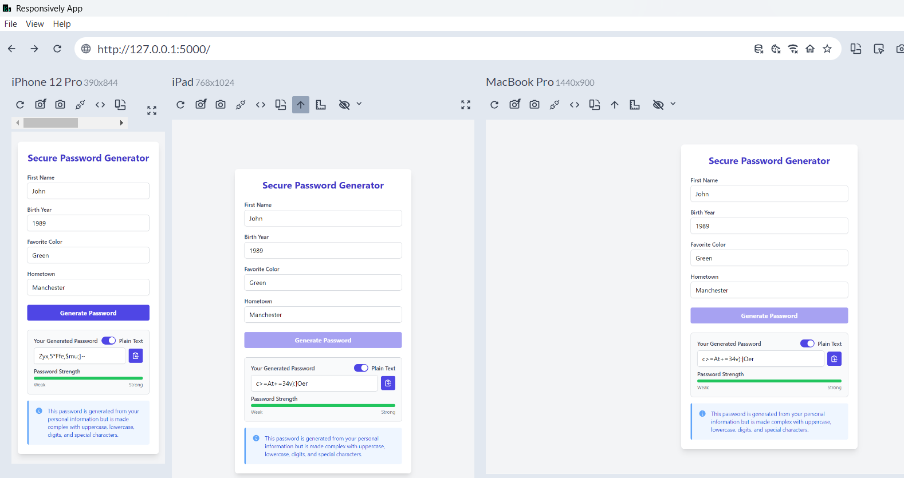

# Secure Password Generator

A Flask-based web application that generates secure passwords based on personal information. The application features a modern user interface built with HTML5, Tailwind CSS, and Alpine.js.

## Table of Contents

- [Overview](#overview)
- [Features](#features)
- [Technologies Used](#technologies-used)
- [Installation](#installation)
- [Usage](#usage)
- [How It Works](#how-it-works)
- [Security Considerations](#security-considerations)
- [Screenshots](#screenshots)
- [License](#license)

## Overview

This Secure Password Generator creates complex passwords that are:
- Unique to each user based on their personal information
- Complex, using a combination of character types
- Available in both plain text and hashed formats
- Easy to copy for immediate use

## Features

- **Personalized Password Generation**: Uses personal information as a seed to generate unique passwords
- **Complex Password Structure**: Includes uppercase letters, lowercase letters, digits, and special characters
- **Toggle Display**: Switch between viewing the plain text password or its SHA-256 hash
- **Password Strength Indicator**: Visual feedback on password strength
- **Copy to Clipboard**: Easily copy the generated password with one click
- **Responsive Design**: Works seamlessly on desktop and mobile devices

## Technologies Used

- **Backend**:
    - Python 3
    - Flask
    - hashlib (for password hashing)

- **Frontend**:
    - HTML5
    - Tailwind CSS (via CDN)
    - Alpine.js (for reactive UI components)

## Installation

1. Clone this repository (or download the `main.py` file)
2. Make sure you have Python 3.x installed
3. Install Flask:
   ```
   pip install flask
   ```

## Usage

1. Run the application:
   ```
   python main.py
   ```
2. Open your browser and navigate to:
   ```
   http://127.0.0.1:5000/
   ```
3. Fill in the personal information form:
    - First Name
    - Birth Year
    - Favorite Color
    - Hometown
4. Click "Generate Password"
5. Toggle between plain text and hashed password views
6. Use the copy button to copy the password to your clipboard

## How It Works

The application works in several steps:

1. **Form Submission**: User enters personal information
2. **Seed Creation**: Personal data is combined to create a seed for the random number generator
3. **Character Selection**:
    - At least one character from each required set (uppercase, lowercase, digits, special)
    - Additional random characters to reach a 16-character length
4. **Password Formation**: Characters are shuffled to produce the final password
5. **Hashing Option**: The password is hashed using SHA-256 for added security

## Security Considerations

- All processing happens server-side, with only the result sent to the client
- The generated password includes at least one character from each character set
- The application doesn't store passwords or personal information
- Passwords are generated based on personal information but are complex enough to resist guessing

## Screenshots

### Desktop View


### Mobile View


## License

This project is open source and available under the [MIT License](LICENSE).